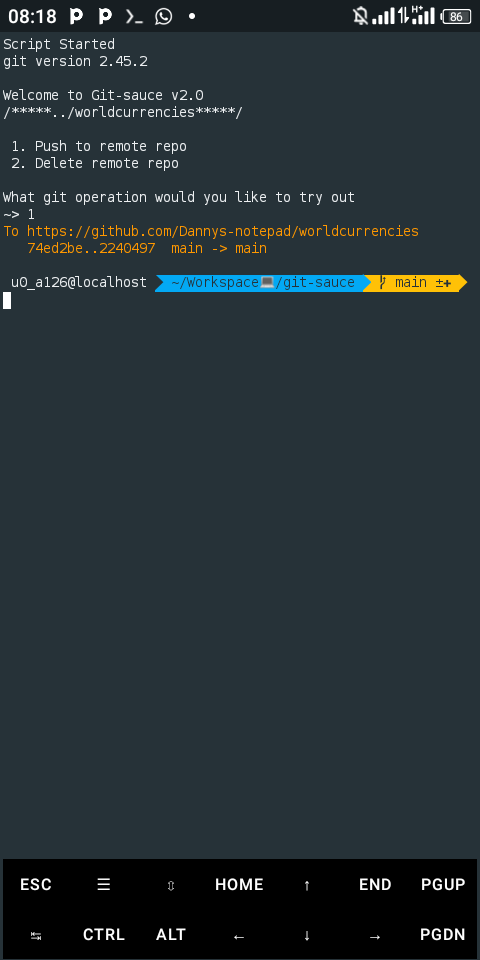

# Git-Sauce version 1.2.2 
> A CLI tool for simplifying git activities

Git-sauce is a simple light weight CLI tool powered by `nodejs`, for easing git processes like Committimg changes,Pulling changes, Merging, Rebasing and lots more, it also tackles git errors increasing your workflow and lessen your development time

`Git-sauce` is only available to Termux/Andriod users for the main time

As of now `Git-sauce v1.2.2` only has committing changes to remote repo feature

Note: you must have git and nodejs installed for the program to run
to install them copy, paste and run the following commands
```sh
$ apt install git
```
```sh
$ apt install nodejs
```
## Installation
```sh
$ git clone https://github.com/Dannys-notepad/git-sauce
```
To install the program, copy and run the above code on your terminal to install the program
## Configuration
```json
[
  {
    "userEmail": "your email here",
    "userName": "your username here",
      "path": "../path/to/project/location",
    "githubLink": "https://[]@github.com/",
    "accessToken": "your git access token here",
    "nameOfRepository": "name of remote repository",
    "branch": "branch name",
    "commitMessage": "an update"
  }
]
```
The project contains a `config.json` file, fill in your credentials in the approprate fields, please fill the approprate fields correctly to enable the program run without errors.

## Usage
```sh
$ npm start
```
After editting to be able to access your project location, run the above code to start the program

Below is a screenshot of the active program



### Note:
`Git-sauce v1.2.2` still has other features under development, had to drop this version for anticipating users, and also next versions releases won't be for just Andriod/Termux users only

## License

MIT

