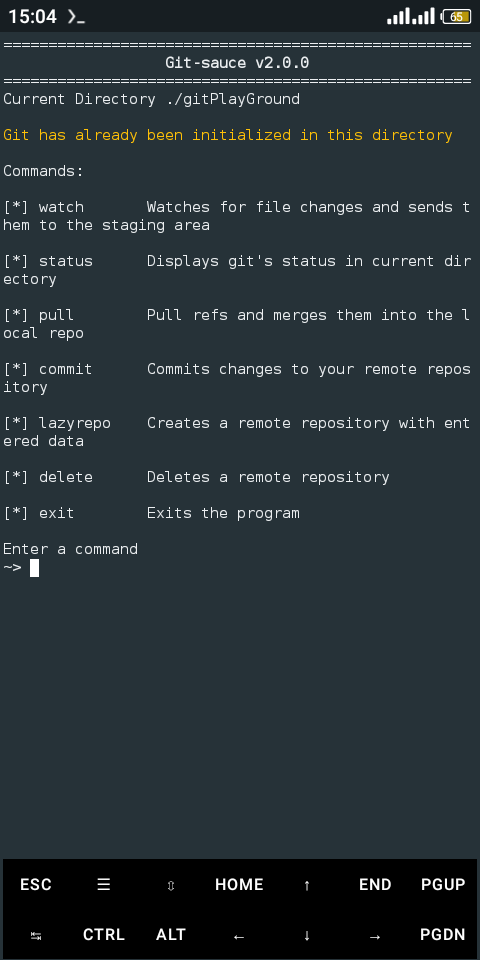
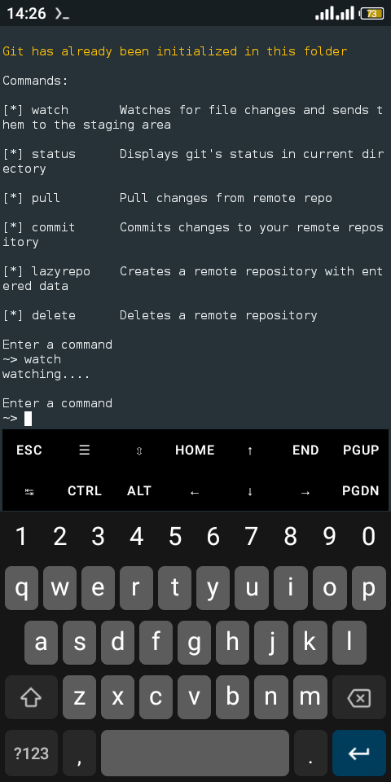
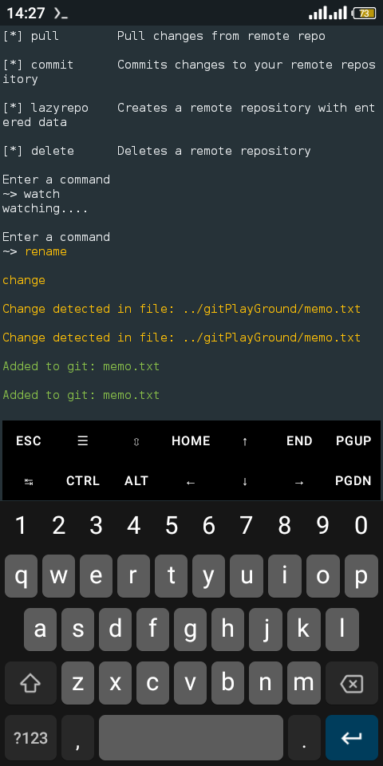
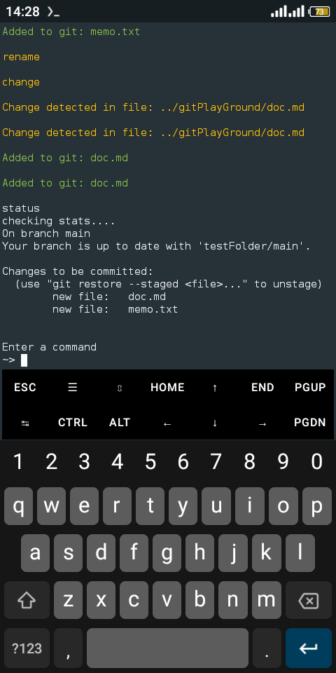

# `Git-Sauce v2.0.0`
> A CLI tool for simplifying git activities

Git-sauce is a simple light weight CLI tool powered by `nodejs`, for easing git processes like Committimg changes, Pulling refs, Merging, Rebasing and lots more, it also tackles git errors increasing your workflow and lessen your development time.

The last version of `Git-sauce` was only available to Termux/Andriod users, but in `Git-sauce v2.0.0` it's available in all OS.

You can find older versions of `Git-sauce` here https://github.com/Dannys-notepad/git-sauce-versions

## `Git-sauce v2.0.0` Features
- Automatically inits and configure git in the directory its being pointed to 
- Watches for file changes in the current directory and adds them to the staging area
- Shows git's staus in the current working directory
- Pull refs into the current working branch
- Commits changes to remote repository
- Creates a remote repository from the terminal with `Git-sauce`
- Deletes a remote repository from the terminal with `Git-sauce`


Note: you must have git, curl and nodejs installed for the program to run
to install them copy, paste and run the following commands:
```sh
$ apt install git
```
```sh
$ apt install curl
```
```sh
$ apt install nodejs
```
The above commands are for termux/andriod users, use your OS provided commands.

## Installation
To install the program, copy and run the below code on your terminal to install the program
```sh
$ git clone https://github.com/Dannys-notepad/git-sauce
```
## Configuration
The project contains a `config.json` file, fill in your credentials in the approprate fields, please fill the approprate fields correctly to enable the program run without errors
```json
[
  {
    "userEmail": "your email here",
    "userName": "your username here",
      "path": "../path/to/project/location",
    "githubLink": "https://[]@github.com/",
    "accessToken": "your git access token here",
    "nameOfRepository": "name of remote repository",
    "branch": "branch name",
    "commitMessage": "an update"
  }
]
```

## Usage
After editting the config file, make sure you're in the root directory of `Git-sauce`, run the below code to start the program
```sh
$ npm start
```
Below is a screenshot of the active program



## `Git-sauce v2.0.0 Commands`
- watch [des] Watches for file changes and sends them to the staging area
- status [des] Displays git's status in current directory
- pull [des] Pull refs and merges them into the local repo
- commit [des] Commits changes to your remote repository
- lazyrepo [des] Creates a remote repository with entered data
- delete [des] Deletes a remote repository
- exit [des] Exits the program

### About the watch command

The **watch** watches the specified directory in the config file, for file changes and adds them to the staging area

When you enter the **watch** command you just get the following message printed on the console, and you don't see an output right away like in image below 



To see an out make changes to files in the specified folder in the config file, then output will be printed on console like in image below



Even with the watch command active and outputs are being printed on the screen you can still enter other commands like in image below



I explained only the **watch** command because the way it works maybe confusing, for first time users.

### Note:
If any bug or error is encountered, please let me know, also if you've got features you'd to add send a pull request, don't forget to star the repo. Thanks :)

## License

MIT

